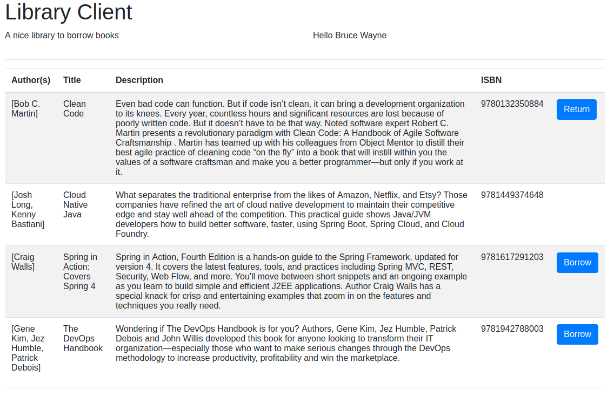
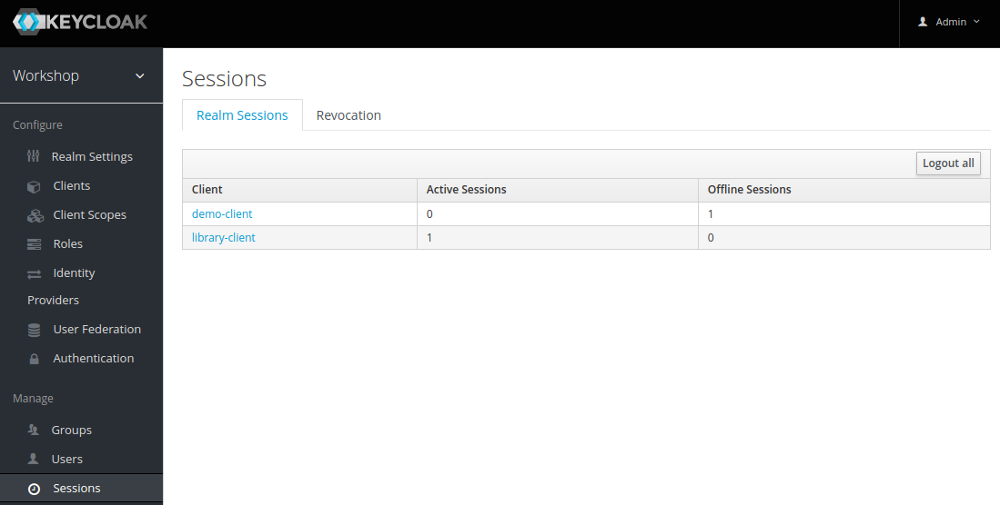

# Lab 2: Creating an OAuth 2.0/OIDC compliant Client

In the second lab we want to build an OAuth2/OIDC client for the resource server we have built in Lab 1.

In [Lab 2](../lab2/README.md) the client will be using
the [OAuth2 authorization code grant flow](https://tools.ietf.org/html/rfc6749#section-4.1).

According to the specification this grant flow is described as follows:
<blockquote cite="https://tools.ietf.org/html/rfc6749#section-4.1">
The authorization code grant type is used to obtain both access tokens and refresh tokens 
and is optimized for confidential clients. Since this is a redirection-based flow, the client 
must be capable of interacting with the resource owner's user-agent (typically a web browser) 
and capable of receiving incoming requests (via redirection) from the authorization server.</blockquote>

__Important Note: The client credentials grant type MUST only be used by confidential clients.__

Later in [Lab 3](../lab3/README.md) we will build almost the same OAuth2 client but in Lab 3 we will be 
using the [client credentials grant flow](https://tools.ietf.org/html/rfc6749#section-4.4) instead. 

See [Spring Security 5 OAuth 2.0 Client reference doc](https://docs.spring.io/spring-security/site/docs/current/reference/htmlsingle/#oauth2client) 
for all details on how to build and configure an OAuth 2.0 client. 

## Lab Contents

* [The workshop application](#the-workshop-application)
  * [Architecture](#the-client-application)
  * [Users and Roles](#users-and-roles)
  * [Logout Users](#logout-users)
* [The Lab 2 tutorial](#lab-2-tutorial)
  * [Lab 2 contents](#lab-2-contents)
  * [Implement the OAuth 2.0/OIDC client](#implement-the-client)
    * [Explore the initial client application](#explore-the-initial-application)
    * [Step 1: Configure as OAuth2/OIDC client](#step-1-configure-as-oauth-2oidc-client)
    * [Step 2: Configure web client to send bearer access token](#step-2-configure-web-client-to-send-bearer-access-token)
    * [Step 3: Configure web client authorities](#step-3-configure-web-client-authorities)
    * [Step 4: Change authentication principal](#step-4-change-authentication-principal)

## The workshop application

In this second workshop lab you will be provided a complete spring mvc web client application that works
together with the [resource server of Lab 1](../lab1/library-server-complete-custom/README.md). 


### The client application

The client is able to fulfill most of the provided uses cases by the server application like:

* View all available books in a list
* Borrow available books
* Return my borrowed books
* Create new books

All action buttons are visible depending on user authorizations, e.g. only users with _LIBRARY_USER_ role can see
the _Borrow_ and _Return_ buttons. The _Return_



### Users and Roles

There are three target user roles for this client and server application:

* LIBRARY_USER: Standard library user who can list, borrow and return his currently borrowed books
* LIBRARY_CURATOR: A curator user who can add, edit or delete books
* LIBRARY_ADMIN: An administrator user who can list, add or remove users

| Username | Email                    | Password | Role            |
| ---------| ------------------------ | -------- | --------------- |
| bwayne   | bruce.wayne@example.com  | wayne    | LIBRARY_USER    |
| bbanner  | bruce.banner@example.com | banner   | LIBRARY_USER    |
| pparker  | peter.parker@example.com | parker   | LIBRARY_CURATOR |
| ckent    | clark.kent@example.com   | kent     | LIBRARY_ADMIN   |

These users are configured for authenticating using keycloak.

We will use [Keycloak](https://keycloak.org) as identity provider.  
Please again make sure you have setup keycloak as described in [Setup Keycloak](../setup_keycloak/README.md).

### Logout Users

After you have logged in into the library client using keycloak your session will remain valid until
the access token has expired or the session at keycloak is invalidated.

As the library client does not have a logout functionality, you have to follow the following steps to actually log out 
users:

* Login to keycloak [admin console](http://localhost:8080/auth/admin) and navigate on the left to menu item _session_
  Here you'll see all user sessions (active/offline ones). By clicking on button _Logout all_ you can revocate 
  all active sessions.




* After you have revocated sessions in keycloak you have to delete the current JSESSION cookie 
  for the library client. You can do this by opening the application tab in the developer tools of chrome.
  Navigate to the cookies entry on the left and select the url of the library client, then delete the cookie 
  on the right hand side 
  


Now when you refresh the library client in the browser you should be redirected again to the login page of keycloak.

## Lab 2 Tutorial

Now, let's start with lab 2. Here we will implement the required additions to get an 
OAuth2/OIDC compliant client that calls the resource server we have implemented in lab 1.

### Lab 2 Contents

In the lab 2 folder you find 2 applications:

* __library-client-initial__: This is the client application we will use as starting point for this lab
* __library-client-complete__: This client application is the completed OAuth 2.0/OIDC client for this lab 

### Implement the Client

#### Explore the initial application

First start the resource server application of Lab 1. If you could not complete the previous Lab yourself
then use and start the completed reference application 
in project [lab1/library-server-complete-custom](../lab1/library-server-complete-custom)

Then navigate your Java IDE to the lab2/library-client-initial project and at first explore this project a bit.  
Then start the application by running the class _com.example.library.client.LibraryClientInitialApplication_.

To test if the application works as expected open a web browser and 
navigate to [localhost:9090/library-client](http://localhost:9090/library-client), when 
basic authentication popup appears use 'user' and 'secret' as login credentials.

Now you should see the message 'Not authenticated' as the library client only authenticates users for the client side
using basic authentication but is not prepared to send the required bearer access token to the resource server.

Now stop the client application again. You can leave the resource server running as we will need this after we have 
finished this client.

<hr>

#### Step 1: Configure as OAuth 2/OIDC client

To change this application into an OAuth2/OIDC client you have to make changes in the dependencies 
of the gradle build file _build.gradle_:

Remove this dependency:
```groovy
implementation('org.springframework.boot:spring-boot-starter-security')
```
and add this dependency instead:
```groovy
implementation ('org.springframework.boot:spring-boot-starter-oauth2-client')
```

Spring security 5 uses the 
[OpenID Connect Discovery](https://openid.net/specs/openid-connect-discovery-1_0.html#ProviderConfig) specification 
to completely configure the client to use our keycloak instance.
  
__Make sure keycloak has been started as described in the [setup section](../setup_keycloak/README.md).__

Navigate your web browser to the url [localhost:8080/auth/realms/workshop/.well-known/openid-configuration](http://localhost:8080/auth/realms/workshop/.well-known/openid-configuration).  
Then you should see the public discovery information that keycloak provides 
(like the following that only shows partial information).

```json
{
  "issuer": "http://localhost:8080/auth/realms/workshop",
  "authorization_endpoint": "http://localhost:8080/auth/realms/workshop/protocol/openid-connect/auth",
  "token_endpoint": "http://localhost:8080/auth/realms/workshop/protocol/openid-connect/token",
  "userinfo_endpoint": "http://localhost:8080/auth/realms/workshop/protocol/openid-connect/userinfo",
  "jwks_uri": "http://localhost:8080/auth/realms/workshop/protocol/openid-connect/certs"
}  
```

For configuring an OAuth2 client the important entries are _issuer_, _authorization_endpoint_, 
_token_endpoint_, _userinfo_endpoint_ and _jwks_uri_.  
Spring Security 5 automatically configures an OAuth2 client by just specifying the _issuer_ uri value 
as part of the predefined spring property _spring.security.oauth2.client.provider.[id].issuer-uri_.

For OAuth2 clients you always have to specify the client registration (with client id, client secret, 
authorization grant type, redirect uri to your client callback and optionally the scope).
The client registration requires an OAuth2 provider. If you want to use your own provider you have to configure
at least the _issuer uri_. We want to change the default user name mapping for the user identity as well (
using the user name instead of the default value 'sub'). 

To perform this step, open _application.yml__ and add the issuer uri property with the additional ones.
Please remove the existing entry for (user.password) as we don't need this any more.
 
After adding this it should look like this:

```yaml
spring:
  thymeleaf:
    cache: false
  security:
    oauth2:
      client:
        registration:
          keycloak:
            client-id: 'library-client'
            client-secret: '9584640c-3804-4dcd-997b-93593cfb9ea7'
            authorizationGrantType: authorization_code
            redirect-uri: '{baseUrl}/login/oauth2/code/{registrationId}'
            scope: openid
        provider:
          keycloak:
            issuerUri: http://localhost:8080/auth/realms/workshop
            user-name-attribute: name
```
An error you get very often with files in yaml format is that the indents are not correct. 
This can lead to unexpected errors later when you try to run all this stuff.

<hr>

#### Step 2: Configure web client to send bearer access token

For all requests to the resource server we use the reactive web client, that was introduced by Spring 5.
The next required step is to make this web client aware of transmitting the required bearer access tokens
in the _Authorization_ header.

To achieve this open the class _com.example.library.client.config.WebClientConfiguration_ and reconfigure the
web client as follows:

```java
package com.example.library.client.config;

import org.springframework.context.annotation.Bean;
import org.springframework.context.annotation.Configuration;
import org.springframework.security.oauth2.client.registration.ClientRegistrationRepository;
import org.springframework.security.oauth2.client.web.OAuth2AuthorizedClientRepository;
import org.springframework.security.oauth2.client.web.reactive.function.client.ServletOAuth2AuthorizedClientExchangeFilterFunction;
import org.springframework.web.reactive.function.client.WebClient;

@Configuration
public class WebClientConfiguration {

  @Bean
  WebClient webClient(
      ClientRegistrationRepository clientRegistrations,
      OAuth2AuthorizedClientRepository authorizedClients) {
    ServletOAuth2AuthorizedClientExchangeFilterFunction oauth2 =
        new ServletOAuth2AuthorizedClientExchangeFilterFunction(
            clientRegistrations, authorizedClients);
    oauth2.setDefaultOAuth2AuthorizedClient(true);
    oauth2.setDefaultClientRegistrationId("keycloak");
    return WebClient.builder().apply(oauth2.oauth2Configuration()).build();
  }
}
```
With this additions we add a filter function to the web client that automatically adds the
access token to all requests and also initiates the authorization grant flow if no valid 
access token is available.

<hr>

#### Step 3: Configure web client authorities

Same as on resource server side we don't want to use the automatic _SCOPE_xxx_ authorities but instead want to
map again the _groups_ claim we get from the automatically called _userinfo_ endpoint to the expected _ROLE_xxx_
authorities.

To achieve this we have to extend the class _com.example.library.client.config.WebSecurityConfiguration_:

```java
package com.example.library.client.config;

import org.springframework.context.annotation.Configuration;
import org.springframework.security.config.annotation.web.builders.HttpSecurity;
import org.springframework.security.config.annotation.web.configuration.WebSecurityConfigurerAdapter;
import org.springframework.security.core.GrantedAuthority;
import org.springframework.security.core.authority.SimpleGrantedAuthority;
import org.springframework.security.core.authority.mapping.GrantedAuthoritiesMapper;
import org.springframework.security.oauth2.core.oidc.OidcIdToken;
import org.springframework.security.oauth2.core.oidc.OidcUserInfo;
import org.springframework.security.oauth2.core.oidc.user.OidcUserAuthority;

import java.util.HashSet;
import java.util.List;
import java.util.Set;
import java.util.stream.Collectors;

@Configuration
public class WebSecurityConfiguration extends WebSecurityConfigurerAdapter {

  @Override
  protected void configure(HttpSecurity http) throws Exception {
    http.authorizeRequests()
        .anyRequest()
        .fullyAuthenticated()
        .and()
        .oauth2Client()
        .and()
        .oauth2Login()
        .userInfoEndpoint()
        .userAuthoritiesMapper(userAuthoritiesMapper());
  }

  private GrantedAuthoritiesMapper userAuthoritiesMapper() {
    return (authorities) -> {
      Set<GrantedAuthority> mappedAuthorities = new HashSet<>();

      authorities.forEach(
          authority -> {
            if (authority instanceof OidcUserAuthority) {
              OidcUserAuthority oidcUserAuthority = (OidcUserAuthority) authority;

              OidcIdToken idToken = oidcUserAuthority.getIdToken();
              OidcUserInfo userInfo = oidcUserAuthority.getUserInfo();

              List<SimpleGrantedAuthority> groupAuthorities =
                  userInfo.getClaimAsStringList("groups").stream()
                      .map(g -> new SimpleGrantedAuthority("ROLE_" + g.toUpperCase()))
                      .collect(Collectors.toList());
              mappedAuthorities.addAll(groupAuthorities);
            }
          });

      return mappedAuthorities;
    };
  }
}
```

With the snippet

```
...
.oauth2Client()
        .and()
        .oauth2Login()
        .userInfoEndpoint()
        .userAuthoritiesMapper(userAuthoritiesMapper());
```
we configure an OAuth2 client and an OIDC login client and reconfigure the _userinfo_ endpoint user mapping
to map authorities different as the standard one. The custom mapping is done in the implementation
of the _GrantedAuthoritiesMapper_ interface that maps entries of the _groups_ claim to authority roles . 

<hr>

#### Step 4: Change authentication principal

The final required step is to change the authentication principal from _org.springframework.security.core.userdetails.User_ 
to _org.springframework.security.oauth2.core.oidc.user.OidcUser_.

We have to change this in class _com.example.library.client.web.BookResource_:

```
import org.springframework.security.oauth2.core.oidc.user.OidcUser;
...
public boolean isReturnBookAllowed() {
    if (!isBorrowed()) {
      return false;
    }

    Object principal = SecurityContextHolder.getContext().getAuthentication().getPrincipal();
    if (principal instanceof OidcUser) {
      OidcUser oidcUser =
          (OidcUser) SecurityContextHolder.getContext().getAuthentication().getPrincipal();
      return borrowedBy != null && borrowedBy.getEmail().equals(oidcUser.getEmail());
    } else {
      // Always fail secure
      return false;
    }
  }
...  
```

and We have to change this in class _com.example.library.client.web.BooksController_:
    
    ```
    import net.minidev.json.JSONArray;
    import org.springframework.security.oauth2.core.user.OAuth2User;
    ...
    @GetMapping("/")
      Mono<String> index(@AuthenticationPrincipal OAuth2User oauth2User, Model model) {
    
        model.addAttribute("fullname", oauth2User.getName());
        model.addAttribute(
            "isCurator",
            ((JSONArray) oauth2User.getAttributes().get("groups")).get(0).equals("library_curator"));
        ...    
    }    
    ...  
    ```

<hr>

#### Step 5: Run/debug the OAuth2 web client application
  
Now re-start the library client and browse again 
to [localhost:9090/library-client](http://localhost:9090/library-client) and login using the different
users:

| Username | Email                    | Password | Role            |
| ---------| ------------------------ | -------- | --------------- |
| bwayne   | bruce.wayne@example.com  | wayne    | LIBRARY_USER    |
| bbanner  | bruce.banner@example.com | banner   | LIBRARY_USER    |
| pparker  | peter.parker@example.com | parker   | LIBRARY_CURATOR |
| ckent    | clark.kent@example.com   | kent     | LIBRARY_ADMIN   |

Now, after authenticating at keycloak you should be able to see the library client. 

If you want to see what is going on behind the scenes just add a debugging breakpoints to the following
classes and methods

<u>Authorization Request:</u>

For this part add a debugging breakpoint to the method 

_OAuth2AuthorizationRequest resolve(HttpServletRequest request, String registrationId, String redirectUriAction)_ 
in class _org.springframework.security.oauth2.client.web.DefaultOAuth2AuthorizationRequestResolver_.

<u>Authorization code redirect callback:</u>

For this part add a debugging breakpoint to the method 

_Authentication attemptAuthentication(HttpServletRequest request, HttpServletResponse response)_
in class _org.springframework.security.oauth2.client.web.OAuth2LoginAuthenticationFilter_

<u>Exchange authorization code for access token:</u>

For this part add a debugging breakpoint to the method  

_OAuth2AccessTokenResponse getTokenResponse(OAuth2AuthorizationCodeGrantRequest authorizationCodeGrantRequest)_ 
in class _org.springframework.security.oauth2.client.endpoint.DefaultAuthorizationCodeTokenResponseClient_

<hr>

That's a wrap for this second Lab.

If time still allows you can continue with [Lab 3](../lab3/README.md) to implement almost the same OAuth2 client
but this time using another OAuth2 grant flow: The client credentials flow (
for machine-to-machine interactions without the need for a user identity).